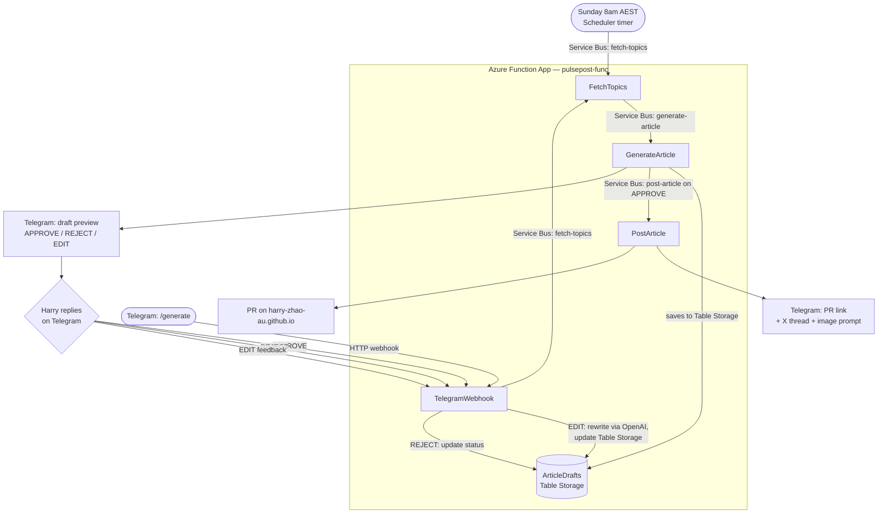
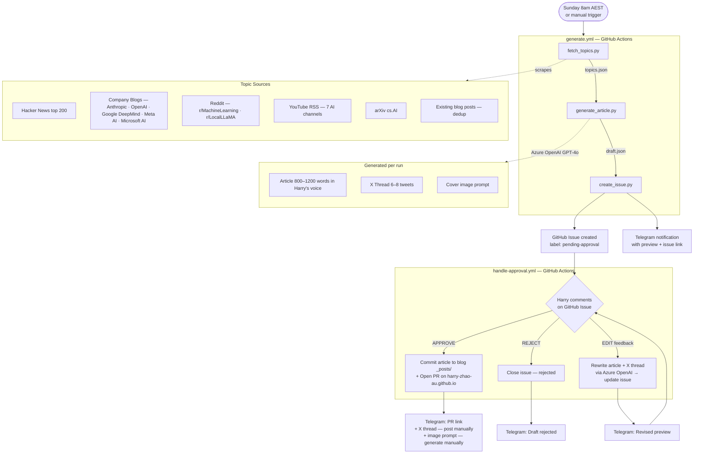

# PulsePost

AI-powered article pipeline — monitors trending AI topics, generates articles in Harry's voice, seeks approval, and publishes to the blog automatically.

---

## Phase 2 — Azure Functions Pipeline

Event-driven, fully automated pipeline running on Azure. Code complete — deploy via `deploy.yml` and Bicep.



**Azure Resources** (resource group `pulsepost-rg`, region `australiaeast`):
- `pulsepost-func` — Function App (.NET 8 isolated, Consumption Y1)
- `pulsepost-bus` — Service Bus Namespace (Basic, 3 queues: `fetch-topics`, `generate-article`, `post-article`)
- `pulsepostsa` — Storage Account (`ArticleDrafts` table)
- `pulsepost-ai` — Application Insights
- `pulsepost-law` — Log Analytics Workspace
- `pulsepost-plan` — App Service Plan (Y1 Consumption)

**Infrastructure deploy** — manually via [Azure Portal Cloud Shell](https://shell.azure.com):
```bash
az group create --name pulsepost-rg --location australiaeast
az deployment group create --resource-group pulsepost-rg --template-file bicep/main.bicep --parameters @parameters.json
```
> Corporate firewall blocks `management.azure.com` — always deploy from Cloud Shell or hotspot, not from a local terminal.

---

## Phase 1 — GitHub Actions Pipeline

Simpler pipeline running entirely on GitHub Actions. Approval happens via GitHub Issue comments; Telegram is notification-only.



**Post-approval manual steps:**
- **X Thread** — copy from Telegram and post on X
- **Cover image** — use the image prompt with DALL-E, upload to `assets/images/` in the blog repo, update front matter, then merge the PR

---

## CI/CD

| Workflow | Trigger | Phase | Purpose |
|---|---|---|---|
| `generate.yml` | Sunday 8am AEST + manual | Phase 1 | Fetch topics → generate draft → create issue + Telegram |
| `handle-approval.yml` | GitHub Issue comment | Phase 1 | Handle APPROVE / REJECT / EDIT |
| `deploy.yml` | Push to `src/**` | Phase 2 | Build and deploy Function App to Azure |
| `infra.yml` | **Manual** — Azure Portal Cloud Shell | Phase 2 | Bicep infra deploy — not auto-triggered |

## Secrets Required

| Secret | Used in | Description |
|---|---|---|
| `GH_PAT` | Both | GitHub Personal Access Token (repo scope) |
| `AZURE_OPENAI_ENDPOINT` | Both | Azure OpenAI instance URL |
| `AZURE_OPENAI_KEY` | Both | Azure OpenAI API key |
| `AZURE_OPENAI_DEPLOYMENT` | Both | GPT-4o deployment name (default: `gpt-4o`) |
| `TELEGRAM_BOT_TOKEN` | Both | Telegram bot token from @BotFather |
| `TELEGRAM_CHAT_ID` | Both | Your Telegram chat ID |
| `AZURE_PUBLISH_PROFILE` | Phase 2 | Publish profile from `pulsepost-func` Azure Portal |

## Project Structure

```
PulsePost/
├── scripts/                   # Phase 1 — Python pipeline (GitHub Actions)
│   ├── fetch_topics.py        # Scrapes HN, blogs, Reddit, YouTube, arXiv
│   ├── generate_article.py    # Topic selection + article + X thread + image prompt
│   ├── create_issue.py        # GitHub Issue creation + Telegram notification
│   └── handle_approval.py     # APPROVE / REJECT / EDIT handling
├── src/PulsePost.Functions/   # Phase 2 — Azure Functions (.NET 8 isolated) — built
│   ├── Functions/             # Scheduler, TelegramWebhook, FetchTopics, GenerateArticle, PostArticle
│   ├── Services/              # OpenAI, Telegram, TopicFetch, DraftStorage, Publish
│   └── host.json
├── bicep/                     # Phase 2 — Azure infrastructure (Bicep)
│   └── main.bicep
├── .github/workflows/
│   ├── generate.yml           # Phase 1 — scheduled generation
│   ├── handle-approval.yml    # Phase 1 — issue comment handler
│   ├── deploy.yml             # Phase 2 — Function App deploy
│   └── infra.yml              # Phase 2 — Bicep deploy (manual only)
└── terraform/                 # Legacy — replaced by Bicep
```
